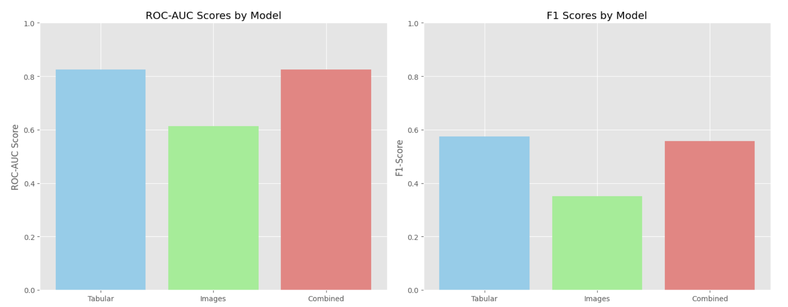
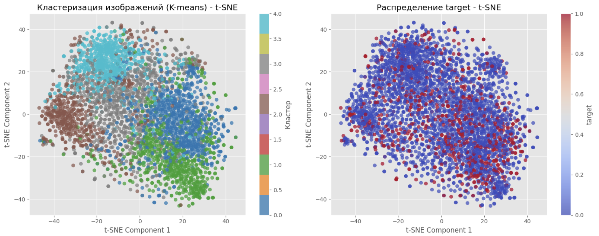

# Analysis of the Impact of Images on Product Success

## Project Description

This project is aimed at studying the impact of visual characteristics of products (images) on their success on a marketplace. A combination of the number of reviews and the product rating was used as a proxy metric for success.

## Repository Structure

```bash
.
├── amazon_images          # Folder with product images
├── analysis.ipynb         # Main notebook with the analysis
├── downloading.ipynb      # Notebook for downloading the dataset
├── final_dataset.csv      # Tabular data
└── README.md
```

## Dataset Features

Initially, it was planned to use the Fashion Product Images dataset from Kaggle, but it was rejected for the following reasons:

* Strong imbalance in ratings (values 9-11 account for only 0.11% of the sample)
* Insufficient amount of rating data for meaningful analysis

Instead, the **Amazon Product Dataset** was used, which contains:

* 3403 products with complete information
* Ratings from 0 to 5
* Number of reviews
* Product images
* Additional attributes (category, sales, etc.)

An important limitation: most images represent covers of books, magazines, movies, and CDs, which narrows the scope of the study to these product categories.

## Methodology

### 1. Data Preparation

* Data cleaning and preprocessing
* Creation of a binary target variable `target`:

  * `success_score = log(reviews_total + 1) * reviews_avg_rating`
  * The top 20% of products by success_score are marked as successful (target=1)
  * The remaining 80% are unsuccessful (target=0)

### 2. Feature Extraction

**Visual features:**

* A pre-trained ResNet18 was used
* 512-dimensional embeddings were extracted for each image
* Zero vectors were used for missing images

**Tabular features:**

* Numerical features: `salesrank` (normalized)
* Categorical features: `group` (one-hot encoding)
* Text embeddings for categories using SentenceTransformer

### 3. Model Building

CatBoostClassifier with regularization was used to prevent overfitting. Three approaches were compared:

1. Tabular features only
2. Image embeddings only
3. Combined features

### 4. Clustering

Clustering of image embeddings was performed using KMeans to identify visual patterns of successful products.

## Results

### Model Quality Metrics:

| Model             | ROC-AUC | F1-Score |
| ----------------- | ------- | -------- |
| Tabular features  | 0.825   | 0.574    |
| Image embeddings  | 0.614   | 0.351    |
| Combined features | 0.825   | 0.557    |



### Clustering:

* Optimal number of clusters: 4
* No significant difference in the share of successful products between clusters was identified
* Visual analysis did not show clear success patterns



## Conclusions

### Impact of Images:

Adding visual features **did not improve** model performance:

* The model based on tabular data showed the best results
* Image embeddings alone showed low performance
* The combined approach did not provide a significant improvement

### Possible Reasons:

1. **Dataset characteristics**: the images are mostly covers, which may not contain decisive information for consumer choice
2. **Class imbalance**: only 20% of products are marked as successful
3. **Model limitations**: a more complex architecture or fine-tuning may be required

### Recommendations for Improvement:

1. Use techniques to address class imbalance (SMOTE, class_weights tuning)
2. Experiment with other models (neural networks, ensembles)
3. Use more modern image processing methods (CLIP, transformers)
4. Collect a more balanced dataset with diverse images

## Conclusion

The study showed that for this type of products (books, magazines, media), visual characteristics are not a determining factor in success. Tabular features have the main predictive power, while visual characteristics are less important compared to other factors (author, content, genre) for this product category. For products where the visual component is more important (clothing, accessories), the results may differ.
